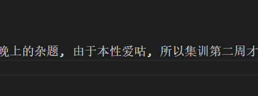
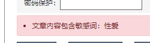

[快七夕了 求个妹子](tencent://message/?uin=3218900047&Site=&Menu=yes)

# 这里是MXR612的博客

> [快速旅行到 "友链"](//Other/友链.html)
> [快速旅行到 "MXR612在cnblogs"](https://www.cnblogs.com/mxxr)
> [快速旅行到 "废话"](#这里是废话)
> [快速旅行到 "游记"](#这里是游记)
> [快速旅行到 "题解"](#这里是题解)
> [快速旅行到 "学习笔记"](#这里是学习笔记)

## 这里是废话

萌新妹子刚学OI欢迎各位小哥哥&小姐姐+Q: [3218900047](tencent://message/?uin=3218900047&Site=&Menu=yes)(麻烦备注下学校&ID鸭

淼淼入坑以来的代码都存在[GitHub](https://github.com/MXR612/OI-log)里面, 可能一些没有写博客的题目都能在里面找到代码. (大部分都没写博客吧?)

开这个博客的原因是在cnblogs发[某一篇博客](//Blog/2020.08.19/LOJ6089.html)的时候, 我作为创作者以第一人称视角体验了何谓"对审核力量的恐惧".

**"我还是尽可能地想做那根站稳了的骨牌。"**

## 这里是游记

[SSL-OI2020夏日合宿](//Index/SSL-OI2020夏日合宿.html)

## 这里是题解

[2020.08.24A组](//Blog/2020.08.24/2020.08.24A.html)
[2020.08.23A组](//Blog/2020.08.23/SSL2020.08.23.html)
[2020.08.22 A组](//Blog/2020.08.22/SSL2020.08.22A.html)
[2020.08.21A组](//Blog/2020.08.21/SSLOJ2020.08.21A.html)
[SSL-OI夏日合宿 2020.08.20 A组](//Blog/2020.08.20/2020.08.20A.html)
[LOJ#6089小Y的背包计数问题](//Blog/2020.08.19/LOJ6089.html)
[2020.08.19](//Blog/2020.08.19/SSLOJ2020.08.19.html)
[POI2018水箱](//Blog/2020.08.18/POI2018水箱.html)
[2020.08.18](//Blog/2020.08.18/SSLOJ2020.08.18.html)
[2020.08.17A组](//Blog/2020.08.17/SSLOJ2020.8.17A.html)

## 这里是学习笔记

~~但是我不喜欢学习~~

想多了吧 OI无妹子

