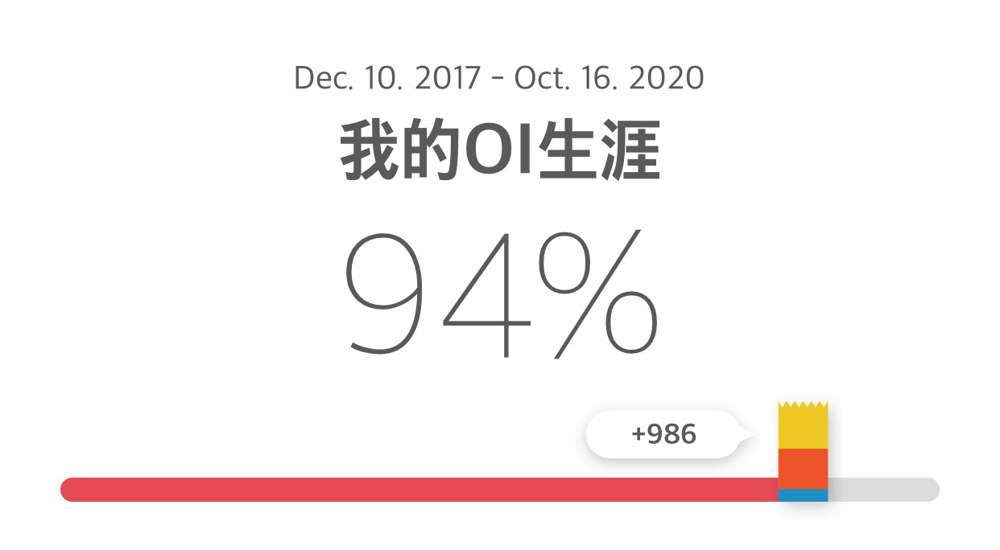

# SSL-OI2020夏日合宿

> 这是最后一次夏日合宿了, 要好好珍惜

## 题解

### 模拟赛

[2020.08.20A组](//Blog/2020.08.20/2020.08.20A.html)
[2020.08.17A组](//Blog/2020.08.17/SSLOJ2020.8.17A.html)
[2020.08.18](//Blog/2020.08.18/SSLOJ2020.08.18.html)
[2020.08.19](//Blog/2020.08.19/SSLOJ2020.08.19.html)

### 杂题

[LOJ#6089小Y的背包计数问题](//Blog/2020.08.19/LOJ6089.html)
[POI2018水箱](//Blog/2020.08.18/POI2018水箱.html)

## 故事

到这个夏末, 我的OI生涯已经走过将近三年. 前两年是毫无感觉的, 不知天高地厚所以也没有丝毫紧张. 那时的我对未来完全没有认知,以为轻松考上重点高中就已经是胜利.

